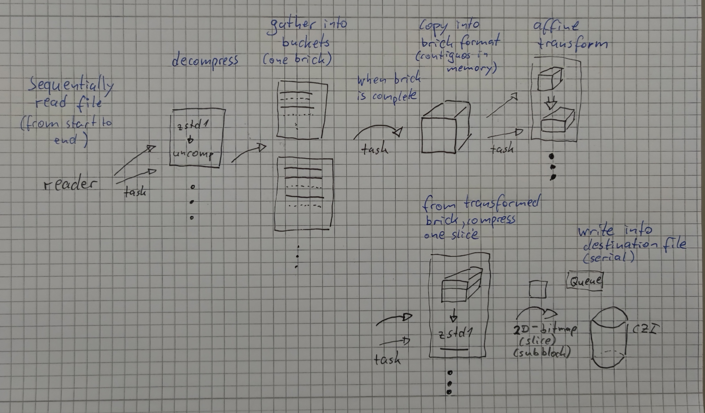

# architecture

## context

The mission statement of this project has been 
* An experimental effort at trying out all sort of ideas and technologies with the sole purpose "make the fastest possible deskew operation".
* The performance of the "deskew operation" is to be measured for a "large CZI-file in, large CZI-file out" scenario. So, I/O-performance is a 
  critical factor in this; assessing the performance is **not** limited to the actual computational side.
* It should be a "real-world scenario", so the correctness and the performance are to be measured on "real-world" datasets, meaning also that it
  should be possible to compare the results directly with existing solutions - without loose ends and "it's not the same" discussions.
 
## design choices and decisions

* For the actual computational part, the family of functions ["WarpAffine"](https://www.intel.com/content/www/us/en/docs/ipp/developer-reference/2021-8/warpaffine.html) from IPP was found to be suitable 
  and of good performance.
* For maximum performance and also for a platform-independent implementation, C++ was choosen as the programming language.
* For levaraging concurrency, the simplest possible approach was choosen: a thread pool with a fixed number of threads.
* [Intel TBB](https://github.com/oneapi-src/oneTBB/) was choosen as the implementation of this thread pool concept - because of its reputation of being a high-performance library and its availability on all relevant platforms.
* The basic mode of operation is that of a [pipeline](https://en.wikipedia.org/wiki/Pipeline_(software))
  * the entities passed between pipeline stages must be independent (of each other, and not related to some global state)
  * processing on those entities must be context-free, the operations should be stateless
  * there should be no assumptions about the order of processing
* The operation is done on a brick which represents a whole stack. This means that we transform a whole stack at once, not individual slices or smaller bricks.
  * This decision limits the concurrency, but it simplifies the implementation and the handling of the data and the operation.
  * Since this is a rather limiting decision, it is envisioned that this will be changed in the future.

## architecture

The overall architecture is that of a pipeline, with the following stages:

| stage | description |
|--|---|
| reading slices from file | Slices (i.e. 2D-bitmaps) are read from a CZI-file. |
| decompress slices | Typically the bitmaps are in a compressed format and must be de-compressed before further processing. |
| compose slices into bricks | The slices are composed into "bricks" (i.e. 3D-bitmaps). |
| transform brick | Such a 3D-bitmap is transformed (a geometric transformation "warp-affine" is applied to them). |
| compress slices of transformed brick | The 2D-slices of the transformed brick are compressed. |
| write slices to file | The 2D-slices are written to a CZI-file. |

The pipeline is depicted here:   

## implementation

### concurrency

The concurrency model is that of a thread pool with a fixed number of threads. The realisation of this concept is done with the interface [ITaskArena](../libwarpaffine/taskarena/ITaskArena.h).   

### reader implemenation

The reading from storage is encapsulated by the interface [ICziBrickReader](../libwarpaffine/brickreader/IBrickReader.h).
There are three implementations of this interface:

| implementation | description |
|--|---|
|[CziBrickReader](../libwarpaffine/brickreader/czi_brick_reader.h) | Simplistic implemantation, using a fixed number of threads (**not** using the thread-pool) which read **and** decode sub-blocks (in the order of "C-index incremented first, then T-index, then M-index").|
|[CziBrickReader2](../libwarpaffine/brickreader/czi_brick_reader2.h) | More sophisticated implementation, using a fixed number threads only for reading from disk, and leveraging the thread-pool for decoding. |
|[CziBrickReaderLinearReading](../libwarpaffine/brickreader/czi_linear_brick_reader.h) | An attempt at implementing the idea of "read-the file from start to end without seeking". |

Notes:

* `CziBrickReaderLinearReading` may not be of production quality, and so far it did not show the hoped-for performance improvement.
* The recommended reader implementation at the moment is `CziBrickReader2`.
* The number of threads used for reading (and decoding in case of `CziBrickReader`) can be specified on the command-line.

## warpaffine implementation

The actual transformation is done by the interface [IWarpAffine](../libwarpaffine/warpaffine/IWarpAffine.h).
There are three implementations of this interface provided:

| implementation | description |
|--|---|
|[WarpAffineIPP](../libwarpaffine/warpaffine/WarpAffine_IPP.h) | Implementation using the IPP-function `ipprWarpAffine`. This implementation is only available of compiled with IPP-support.|
|[WarpAffineReference](../libwarpaffine/warpaffine/WarpAffine_Reference.h) | A non-optimized C++ implementation. Only NN-sampling and linear interpolation are supported. |
|[WarpAffineNull](../libwarpaffine/warpaffine/WarpAffineNull.h) | This implementation does no actual calculations, but creates an output of "all pixels zero". It is useful for performance testing only. | |

## writer implementation

The writing to storage is encapsulated by the interface [ICziSlicesWriter](../libwarpaffine/sliceswriter/ISlicesWriter.h).
There are two implementations of this interface:

| implementation | description |
|--|---|
|[SlicesWriterTbb](../libwarpaffine/sliceswriter/SlicesWriterTbb.h) | This implementation uses a multiple-producer-single-consumer queue in order to serialize the write-operation.|
|[NullSlicesWriter](../libwarpaffine/sliceswriter/NullSlicesWriter.h) | Implementation which does nothing, useful for testing only.|

